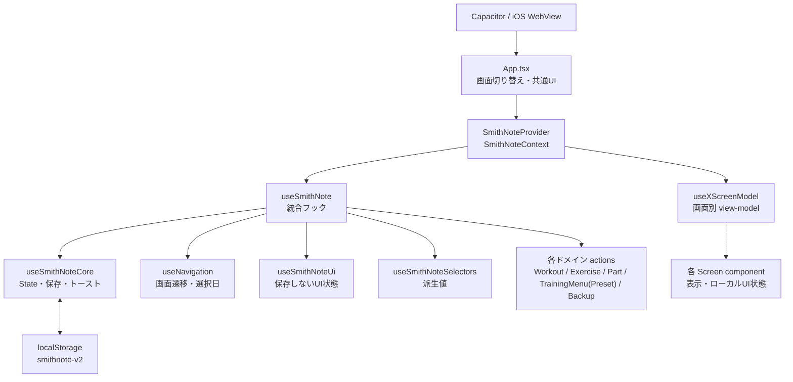
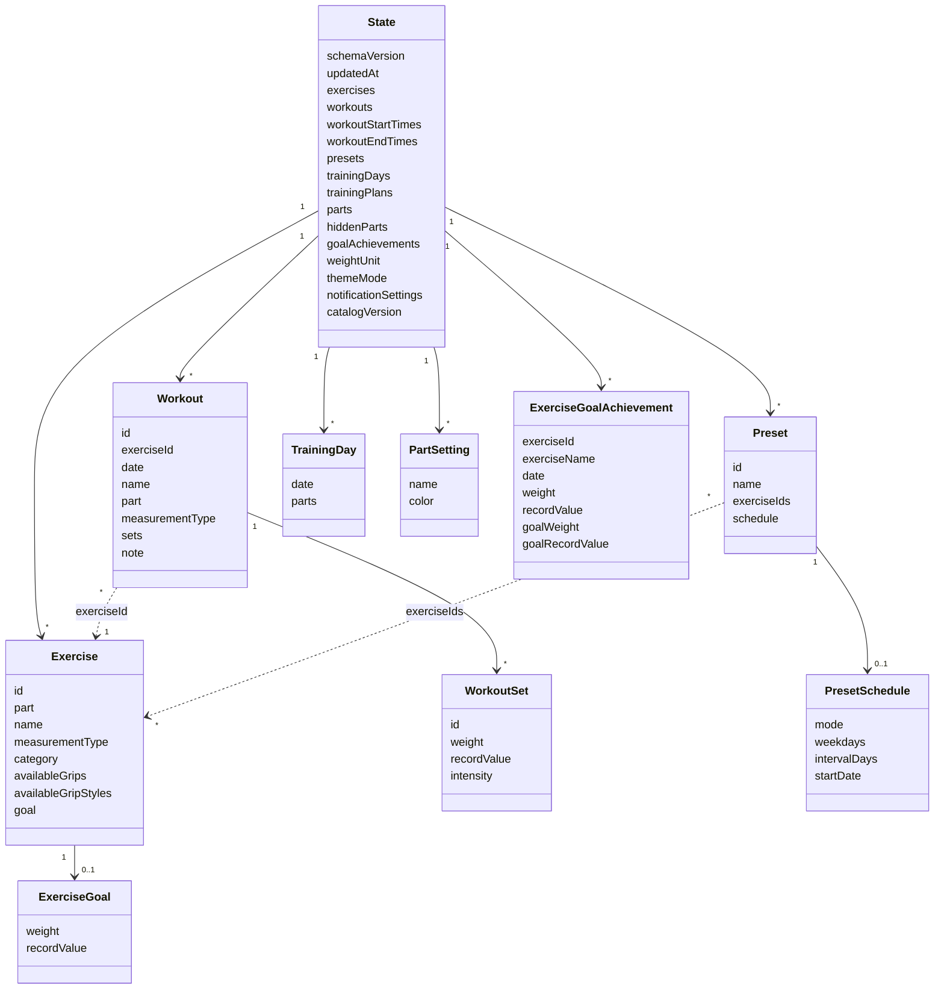
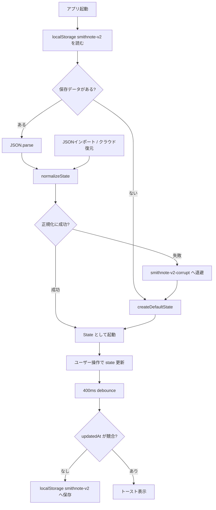
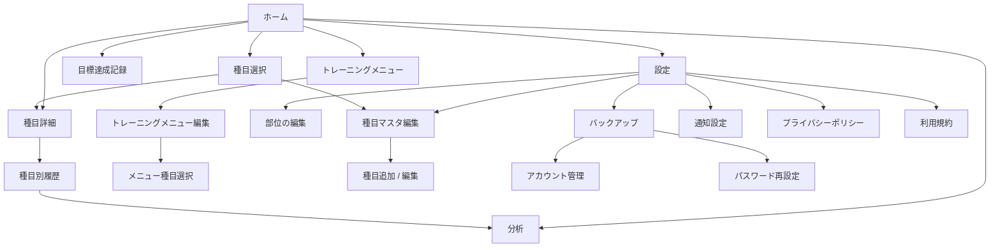

# SmithNote 詳細仕様書

本書は SmithNote の実装に基づく詳細仕様を記述します。概要と索引は [`README.md`](./README.md) を参照してください。

対象バージョンの基準: `src/` の現行実装。

## 読み方ガイド

この仕様書は正本として詳細を残すため、目的に合わせて必要な章だけ読むことを前提にします。

| 目的 | 読む場所 |
| --- | --- |
| アプリの全体像を知りたい | 1章、3章 |
| 使っている技術や主要ファイルを確認したい | 2章 |
| 状態管理・画面への値の流れを知りたい | 3章 |
| 保存データの型や互換性を確認したい | 4章、5章 |
| 画面仕様や画面遷移を確認したい | 6章 |
| 計算ロジックや操作の詳細を確認したい | 7章、8章 |
| UI方針・テスト観点を確認したい | 9章、10章 |
| 初期種目の内容を確認したい | 11章 |

---

## 1. プロジェクト概要

- **SmithNote** は React + Vite + TypeScript で作られた筋トレ記録モバイルアプリです。
- アプリ本体はCapacitorを使ってiOS向けにビルドし、GitHub Pagesでも公開します。
- 通常の記録データは端末の `localStorage` に保存され、未ログインでもローカル完結で利用できます。
- Firebase設定がある環境では、希望するユーザーだけメールアドレス・パスワードでログインし、手動クラウドバックアップ/復元を利用できます。
- モバイル優先のレイアウトで、起動直後から記録を始められます。
- GitHub Pagesでは `/FitLog/` にランディングページ、`#/privacy` と `#/terms` に公開文書を配信します。

### 1.1 設計思想

- 起動後すぐに「選択日のトレーニング一覧」を表示し、最短手数で記録できる。
- ネットワークなしでも記録機能が動作する（Capacitor WebView + localStorage）。
- 状態管理は単一の `State` ツリーに集約し、保存データとの互換性を最優先する。
- 画面コンポーネントは小さく保ち、状態と操作はフック層に閉じ込める。

---

## 2. 技術スタック・ビルド構成

| 区分 | 採用技術 |
| --- | --- |
| UI | React 19 系 |
| ルーティング | React Router（Declarative Mode / `HashRouter`） |
| ビルド | Vite |
| 言語 | TypeScript |
| Web公開 | ランディングページとアプリ本体（GitHub Pages） |
| ネイティブアプリ | Capacitor iOS |
| クラウドバックアップ | Firebase Authentication / Cloud Firestore |
| アイコン | `@tabler/icons-react` |
| テスト | Vitest + jsdom / Playwright |
| Lint / Format | ESLint + Prettier |

### 2.1 開発コマンド

```bash
npm run dev          # 開発サーバー
npm run dev:app      # モバイルアプリ本体の開発サーバー
npm run build        # GitHub Pages用ランディングページとアプリ本体の生成
npm run build:ios    # Capacitor/iOS 向け Web アセット生成
npm run cap:sync:ios # build:ios 後に iOS プロジェクトへ同期
npm run cap:open:ios # Xcode で ios プロジェクトを開く
npm run preview      # ビルド成果物のプレビュー
npm test             # vitest run
npm run test:watch   # vitest watch
npm run test:e2e     # Playwright E2E
npm run test:e2e:ui  # Playwright UI モード
npm run lint         # eslint
npm run format       # prettier --write
```

- `npm run build` は型チェック後、GitHub Pages用ランディングページとアプリ本体を生成します。Service Workerは含みません。
- `npm run build:ios` は `vite build --mode capacitor` を実行し、Capacitor の WebView で読み込める相対パスの Web アセットを生成します。
- `npm run cap:sync:ios` は `build:ios` の後に `cap sync ios` で `dist/` を `ios/` プロジェクトへ同期します。

GitHub Pagesのトップ `/FitLog/` はランディングページ、`/FitLog/app/` はアプリ本体です。「アプリを使う」から記録画面を開けます。両方を1回のビルド・デプロイで更新します。

### 2.2 ビルド設定（`vite.config.ts`）

| 区分 | 設定 | 内容 |
| --- | --- | --- |
| 通常ビルド | `base: '/FitLog/'` | LPと `app/index.html` の2つのエントリを生成する |
| Capacitor ビルド | `mode: 'capacitor'` / `base: './'` | アプリ本体エントリを使い、WebView向け相対パスにする |
| エントリ分岐 | `import.meta.env.MODE` | 通常時はLPと `/app/` のアプリ本体、Capacitor modeではアプリ本体だけをバンドルする |
| LP設定 | `src/landing/config.ts` | App Store URL、問い合わせ先、canonical URL、文書更新日を集約する |
| LP公開文書 | `#/privacy` / `#/terms` | プライバシーポリシーと利用規約をハッシュルートで公開する |
| アイコン | `favicon.png` / `apple-touch-icon.png` / `AppIcon-512@2x.png` | `public/image.png` を元画像として使う |
| スプラッシュ画像 | `Splash.imageset` | iOSのLaunchScreen用画像を使う |
| iOS 画面向き | `UISupportedInterfaceOrientations` | `ios/App/App/Info.plist` でポートレート表示のみに限定する |

### 2.3 エントリポイント

- `src/entry.ts` がbuild modeに応じて `src/landing/main.tsx` または `src/mobile.tsx` を読み込む。
- モバイル側は `React.StrictMode` → `HashRouter` → `ErrorBoundary` → `App` の順に包む。
- 通常ビルドではPWAやアプリ本体を配信しない。

### 2.4 プロジェクト構成 / 主要ファイル

| パス | 役割 |
| --- | --- |
| `index.html` | HTML エントリー |
| `package.json` | 依存とスクリプト |
| `capacitor.config.ts` | Capacitor の appId / appName / webDir 設定 |
| `vite.config.ts` | LP / Capacitorエントリとbaseの切り替え |
| `vitest.config.ts` | Vitest 設定（jsdom） |
| `tsconfig.json` | TypeScript プロジェクト参照の統括設定 |
| `tsconfig.app.json` | アプリ本体の TypeScript 設定 |
| `tsconfig.node.json` | Vite 設定の TypeScript 設定 |
| `eslint.config.mjs` | ESLint 設定 |
| `.github/workflows/deploy-pages.yml` | GitHub Pages デプロイ workflow |
| `ios/` | Capacitor が生成した iOS / Xcode プロジェクト |
| `docs/` | 仕様・設計ドキュメント |
| `src/entry.ts` | build modeに応じたエントリ分岐 |
| `src/mobile.tsx` | モバイルアプリのエントリ（`HashRouter` + `ErrorBoundary`） |
| `src/landing/` | LP、公開文書、スタイル、外部リンク設定 |
| `src/App.tsx` | 画面切り替え・ボトムナビ・トースト |
| `src/routes.ts` | 画面とハッシュURLの対応、パスから画面への変換 |
| `src/types.ts` | 共通の TypeScript 型 |
| `src/utils.ts` | 日付・計算・汎用ヘルパー |
| `src/storage.ts` | `localStorage` の読み込み・壊れたデータの退避 |
| `src/storageNormalization.ts` | 保存データの既定値・正規化・後方互換処理 |
| `src/icons.tsx` | アイコン |
| `src/styles.css` | CSS の入口（`src/styles/` を読み込む） |
| `src/hooks/` | 状態管理・操作フック、Context Provider・参照フック |
| `src/hooks/useSmithNote.ts` | 各ドメインフックを束ねる統合フック |
| `src/selectors/smithNoteSelectors.ts` | React 非依存の純粋な派生値計算（セレクタ） |
| `src/screens/` | 各画面コンポーネント（view-model フックで Context から取得） |
| `src/components/` | 小さな再利用コンポーネント（共通画面ヘッダ・エラー境界・セット行・強度アイコンなど） |
| `src/data/starterExercises.ts` | 初期種目マスタとカタログ版 |
| `src/data/partColors.ts` | 部位の表示色パレット（8 色）と既定色 |
| `src/styles/` | 役割ごとに分割した CSS |
| `src/*.test.ts` | テスト対象の隣に置く Vitest のテスト |

```text
SmithNote/
├── index.html                # HTML エントリー
├── package.json              # 依存とスクリプト
├── capacitor.config.ts       # Capacitor 設定
├── vite.config.ts            # LP / Capacitor ビルド設定
├── vitest.config.ts          # Vitest 設定(jsdom)
├── tsconfig.json             # TypeScript 設定
├── eslint.config.mjs         # ESLint 設定
├── .github/
│   └── workflows/
│       └── deploy-pages.yml  # GitHub Pages デプロイ
├── docs/                     # 仕様・設計ドキュメント
├── ios/                      # Capacitor iOS プロジェクト
│   ├── README.md             # 概要・索引
│   ├── specification.md      # 詳細仕様
│   └── improvements.md       # 改善候補の備忘録
└── src/
    ├── entry.ts              # build modeに応じたエントリ分岐
    ├── mobile.tsx            # モバイルアプリのエントリ
    ├── landing/              # LP、公開文書、設定、スタイル
    ├── App.tsx               # 画面切り替え・ナビ・トースト
    ├── routes.ts             # 画面とハッシュURLの対応
    ├── types.ts              # 共通の型
    ├── utils.ts              # 日付・計算・汎用ヘルパー
    ├── storage.ts            # localStorage の読み込み・退避
    ├── storageNormalization.ts # 保存データの正規化・互換処理
    ├── icons.tsx             # アイコン
    ├── styles.css            # CSS の入口
    ├── *.test.ts             # Vitest のテスト
    ├── components/           # 再利用コンポーネント
    ├── data/                 # 種目マスタなどの初期データ
    ├── hooks/                # 状態管理・操作フックと Context
    ├── screens/              # 各画面コンポーネント
    ├── selectors/            # 純粋な派生値計算
    └── styles/               # 役割ごとに分割した CSS
```

---

## 3. アーキテクチャ

### 3.1 レイヤー構成



```
useSmithNoteCore (state + 永続化 + トースト)
        │
        ├─ useNavigation     (画面遷移・選択日・対象ワークアウト)
        ├─ useSmithNoteUi       (保存対象外の一時 UI 状態)
        ├─ useSmithNoteSelectors / selectors/smithNoteSelectors.ts (派生値)
        ├─ usePresetActions
        ├─ useWorkoutActions
        ├─ useExerciseActions
        ├─ usePartActions
        └─ useBackup
        │
   useSmithNote (上記を統合し state・派生値・actions を組み立てる)
        │
   SmithNoteContext (Provider で全体へ配布)
        │
   各画面の useXScreenModel (Context から必要な値だけ取り出す view-model)
        │
   画面コンポーネント (表示とローカル UI 状態のみ)
```

### 3.2 各フックの責務

| フック | ファイル | 責務 |
| --- | --- | --- |
| `useSmithNoteCore` | `hooks/useSmithNoteCore.ts` | `State` の保持、`localStorage` 保存（デバウンス・flush・失敗通知）、トースト管理、`saveState` / `setState` 提供 |
| `useNavigation` | `hooks/useNavigation.ts` | React Router の現在パスから導出する `screen`、`transitionFrom` / `transitionDirection` / `selectedDate` / `currentWorkoutId` の管理、進む・戻る画面遷移、日付・月移動、離脱時の空セット掃除 |
| `useHomeCalendar` | `hooks/useHomeCalendar.ts` | ホームの週/月カレンダー表示、スワイプ遷移、選択日の同期 |
| `useExerciseReorder` | `hooks/useExerciseReorder.ts` | 種目のドラッグ中レイアウトとカテゴリを管理し、終了時に確定 |
| `useSmithNoteUi` | `hooks/useSmithNoteUi.ts` | 保存しない一時 UI 状態（編集モード、部位タブ、履歴フィルタ、トレーニングメニュー下書き） |
| `useSmithNoteSelectors` | `hooks/useSmithNoteSelectors.ts` | `state` と `selectedDate` から派生値を `useMemo` で計算 |
| `usePresetActions` | `hooks/usePresetActions.ts` | トレーニングメニューの選択・下書き保存・削除・一括投入 |
| `useWorkoutActions` | `hooks/useWorkoutActions.ts` | ワークアウト/セットの追加・更新・削除・並び替え・詳細を開く |
| `useExerciseActions` | `hooks/useExerciseActions.ts` | 種目マスタの追加・計測方法変更・削除・ドラッグ並び替え |
| `usePartActions` | `hooks/usePartActions.ts` | 部位の追加・削除・並び替え・表示色変更 |
| `useBackup` | `hooks/useBackup.ts` | JSON エクスポート / インポート |
| `useSmithNote` | `hooks/useSmithNote.ts` | 上記を束ね、画面へ渡す値と `actions` をまとめる統合フック |

### 3.3 配布と view-model パターン

- `SmithNoteProvider`（`hooks/SmithNoteContext.tsx`）が `useSmithNote()` の戻り値を Context へ流す。
- `useSmithNoteContext()`（`hooks/useSmithNoteContext.ts`）は Provider 外で呼ぶと例外を投げる。
- 各画面は props を受け取らず、画面固有の `useXScreenModel()` フックで Context から必要な値・操作だけを取り出す。
- 画面ローカルの一時状態（削除確認ダイアログの対象、カレンダー開閉など）は画面コンポーネント内の `useState` で持つ。

---

## 4. ドメインモデル / データ型

型定義は `src/types.ts`。

### 4.1 `State`（永続化される全体ツリー）

| フィールド | 型 | 内容 |
| --- | --- | --- |
| `schemaVersion` | `number` | 保存データ全体のスキーマバージョン |
| `exercises` | `Exercise[]` | 種目マスタ（部位・名前・計測方法・器具カテゴリ） |
| `goalAchievements` | `ExerciseGoalAchievement[]` | 種目目標の達成記録（達成日・実際のセット値・達成時の目標値） |
| `workouts` | `Workout[]` | 日付ごとの記録（セットを含む） |
| `workoutStartTimes` | `Record<string, string>` | 日付ごとのトレーニング開始時刻（`HH:mm`） |
| `workoutEndTimes` | `Record<string, string>` | 日付ごとのトレーニング終了時刻（`HH:mm`） |
| `presets` | `Preset[]` | トレーニングメニュー（よく使う種目のまとまりと任意のスケジュール） |
| `trainingDays` | `TrainingDay[]` | 日付ごとの実施部位（履歴の補助情報） |
| `trainingPlans` | `TrainingPlan[]` | 旧バージョンの部位別計画（読み込み互換用。画面では使用しない） |
| `parts` | `PartSetting[]` | 部位の表示設定（表示順は配列順、`color` に表示色 HEX）。「レスト」は対象外 |
| `hiddenParts` | `string[]` | 部位編集で非表示にした部位名（履歴由来の自動復活を防ぐ） |
| `weightUnit` | `WeightUnit` | アプリ内の重量入力・表示に使う単位（`kg` / `lbs`）。保存値は kg のまま保持する |
| `themeMode` | `ThemeMode` | アプリの外観設定（`dark` / `light`） |
| `notificationSettings` | `NotificationSettings` | トレーニング未記録時のローカル通知設定 |
| `restTimerSettings` | `RestTimerSettings` | レストタイマーの挙動設定 |
| `updatedAt` | `string` | 保存競合判定用の更新日時 |
| `catalogVersion` | `number` | 種目マスタのカタログ版（追補判定に使用） |

### 4.2 各型

ユーザー向け名称は「トレーニングメニュー」です。保存データと実装上の型名は、互換性のため `Preset` / `PresetSchedule` を使います。

```ts
type MeasurementType = 'reps' | 'seconds';
type SetIntensity = 1 | 2 | 3 | 4 | 5;
type SetAchievement = 'achieved' | 'missed';
type ExerciseCategory = 'free' | 'machine' | 'dumbbell' | 'cable' | 'bodyweight';
type GripType = 'normal' | 'reverse' | 'parallel' | 'alternate';
type GripStyleType = 'thumbAround' | 'thumbLess' | 'thumbUp' | 'hook';
type WeightUnit = 'kg' | 'lbs';

type RestTimerSettings = {
  autoStartOnIntensity: boolean;
  defaultSeconds: number;
  alertVolume: number;
};

type ExerciseGoal = {
  weight: number;      // 目標重量（保存値は kg）
  recordValue: number; // 目標回数 or 秒数
};

type ExerciseGoalAchievement = {
  id: string;
  exerciseId: string;
  exerciseName: string;             // 達成時点の種目名
  measurementType: MeasurementType; // 達成時点の計測方法
  date: string;                     // 達成日 YYYY-MM-DD
  weight: number;                   // 達成セットの重量（kg）
  recordValue: number;              // 達成セットの回数 or 秒数
  goalWeight: number;               // 達成した目標重量（kg）
  goalRecordValue: number;          // 達成した目標回数 or 秒数
};

type Exercise = {
  id: string;
  part: string;          // 部位（例: 胸 / 背中 / 脚 / 肩 / 腕 / その他）
  name: string;          // 種目名
  note?: string;         // 日付をまたいで引き継ぐ種目共通メモ
  measurementType: MeasurementType; // 記録単位（回数 / 秒数）
  category: ExerciseCategory; // 器具カテゴリ（種目リスト内の小見出し分類）
  availableGrips?: GripType[]; // この種目で選択できる握りの向き
  availableGripStyles?: GripStyleType[]; // この種目で選択できる握り方
  goal?: ExerciseGoal;   // 現在の目標（任意）
};

type WorkoutSet = {
  id: string;
  weight: number | null;        // 重量（保存値は kg）。未入力は null
  recordValue: number | null;   // 実績の回数 or 秒数。未入力は null
  targetRecordValue?: number | null; // 未達時などに退避した目標回数 or 秒数
  achievement?: SetAchievement;  // 目標に対する達成状態（達成 / 未達）
  intensity?: SetIntensity;     // 主観強度（任意）
};

type Workout = {
  id: string;
  exerciseId: string;    // 元の Exercise.id
  date: string;          // 'YYYY-MM-DD'（ローカル日付）
  name: string;          // 記録時点の種目名のスナップショット
  part: string;          // 記録時点の部位のスナップショット
  measurementType: MeasurementType;
  grip?: GripType;       // この日の種目記録に対する握りの向き（任意）
  gripStyle?: GripStyleType; // この日の種目記録に対する握り方（任意）
  sets: WorkoutSet[];
  note: string;          // その日の種目記録に対するメモ
  usageElapsedSeconds: number; // 停止済みの種目実施時間（秒）
  usageStartedAt?: string; // 実施時間を計測中の場合の開始日時（ISO 8601）
};

type WorkoutStartTimes = Record<string, string>; // date(YYYY-MM-DD) -> HH:mm
type WorkoutEndTimes = Record<string, string>; // date(YYYY-MM-DD) -> HH:mm

type Preset = {
  id: string;
  name: string;
  exerciseIds: string[]; // 投入する種目 ID の順序付きリスト
  schedule?: PresetSchedule;
};

type PresetSchedule = {
  mode: TrainingPlanMode;
  weekdays: number[];    // 0=日 〜 6=土（weekly のとき有効）
  intervalDays: number;  // 何日ごと（interval のとき有効、>=1）
  startDate: string;     // 'YYYY-MM-DD'（interval の起点）
};

type TrainingDay = {
  date: string;          // 'YYYY-MM-DD'
  parts: string[];       // その日に実施した部位
};

type TrainingPlanMode = 'weekly' | 'interval';

type TrainingPlan = {
  id: string;
  part: string;
  mode: TrainingPlanMode;
  weekdays: number[];    // 0=日 〜 6=土（weekly のとき有効）
  intervalDays: number;  // 何日ごと（interval のとき有効、>=1）
  startDate: string;     // 'YYYY-MM-DD'（interval の起点）
};

type PartSetting = {
  name: string;          // 部位名
  color: string;         // 表示色（HEX）。8 色パレットから選択
};
```

部位の表示色パレットは `src/data/partColors.ts`（`partColorPalette` の 8 色、既定色 `defaultPartColor`）。

### 4.3 種目マスタと記録の責務分離

- `Exercise` は「何を行うか」の軽量マスタ（`id` / `part` / `name` / `measurementType` / `category`）と、種目ごとの握りの向き候補（`availableGrips`）、握り方候補（`availableGripStyles`）、現在目標（`goal`）を持つ。
- `ExerciseGoalAchievement` は達成時点の種目名・計測方法をスナップショットとして保持するため、後から種目を改名・削除しても履歴表示を維持する。
- 実際の重量・回数（秒数）・強度は `WorkoutSet`、その日の種目単位の握りの向き・握り方・メモは `Workout` に保存する。
- `Workout` は `name` / `part` / `measurementType` を記録時点のスナップショットとして保持するため、後でマスタを編集しても過去の記録表示は変わらない（種目の並び替え時のみ後述の同期がある）。

### 4.4 データ構造図

`State` は保存対象の全体ツリーです。画面ローカルの開閉状態や下書きなど、保存しない一時状態は `useSmithNoteUi` や各画面コンポーネントに置きます。



---

## 5. データ永続化・移行

実装は `src/storage.ts`、`src/storageNormalization.ts`、`hooks/useSmithNoteCore.ts`。

### 5.1 読み込み・保存フロー図

起動時は保存データを正規化してから `State` として使います。実行中の変更は debounce で `localStorage` へ保存し、インポートやクラウド復元では同じ正規化処理を通してから置き換えます。



### 5.2 ストレージキー

| キー | 用途 |
| --- | --- |
| `smithnote-v2` | 通常の保存データ |
| `smithnote-v2-corrupt` | 読み込みに失敗した壊れたデータの退避先 |
| `smithnote-device-id` | クラウドバックアップ時に作成元端末を識別する端末ID |

### 5.3 保存戦略（`useSmithNoteCore`）

- `state` 変化のたびに **400ms デバウンス**（`SAVE_DEBOUNCE_MS`）でまとめて書き込む。
- **初回マウント時の保存はスキップ**（読み込んだ内容を書き戻すだけのため）。
- `visibilitychange` で非表示になった瞬間、および `pagehide` 時に、デバウンス待ちの内容を即時 flush する（`stateRef` で最新 state を参照）。
- 保存データには `updatedAt` を持たせ、保存前に `localStorage` 側の `updatedAt` と照合する。別タブ・別ウィンドウで更新済みの場合は保存を止め、「別のタブで更新されました。再読み込みしてから続けてください」を表示する。
- `storage` イベントで別タブの更新を検知し、古い state からの無警告上書きを防ぐ。
- 書き込みは `try/catch` で保護し、失敗時は「保存に失敗しました。空き容量を確認してください」をトースト表示。
- 通常トーストは表示後 **1800ms**、Undo などの操作つきトーストは **5000ms** で自動的に消える。閉じるボタンから手動でも消せる。表示中に次のトーストが発火した場合はキューへ積み、順番に表示する。

### 5.4 読み込み（`loadState` → `LoadResult`）

`loadState()` は `{ state, recoveredFromCorruption }` を返す。

1. `localStorage.getItem` 自体が例外 → 既定状態で起動（復旧フラグ false）。
2. 値が無い / `'null'` → 既定状態で起動。
3. `JSON.parse` + `normalizeState` が成功 → その state で起動。
4. 解析・正規化に失敗 → 元データを `smithnote-v2-corrupt` へ退避（`removeItem` はしない）し、既定状態で起動（復旧フラグ true）。
   - 復旧フラグが true のときは「保存データを読み込めませんでした。旧データは退避済みです」をトースト表示。
   - 退避自体に失敗しても元データは `smithnote-v2` 側に残るため握りつぶす。

### 5.5 既定状態（`createDefaultState`）

- `exercises`: スターター種目（`data/starterExercises.ts`）。
- `presets`: 既定トレーニングメニュー 4 件（`胸の日` / `背中の日` / `脚の日` / `肩の日`、いずれも種目空）。
- `workouts` / `trainingDays` / `trainingPlans`: 空配列。
- `goalAchievements`: 空配列。
- `workoutStartTimes` / `workoutEndTimes`: 空オブジェクト。
- `weightUnit`: `'kg'`。
- `themeMode`: `'dark'`。
- `notificationSettings`: `{ enabled: false }`。
- `restTimerSettings`: `{ autoStartOnIntensity: true, defaultSeconds: 60, alertVolume: 100 }`。
- `schemaVersion`: 現在の保存データバージョン。
- `updatedAt`: 保存競合判定用の更新日時。
- `hiddenParts`: 空配列。
- `catalogVersion`: `starterCatalogVersion`（現在 `6`）。

### 5.6 正規化・移行（`normalizeState`）

- `exercises` か `workouts` が無ければ `null` を返す（＝壊れている扱い）。
- 各配列を専用 normalize 関数で正規化し、不正要素は除外（`flatMap` で drop）。
- **種目マスタ追補**: 保存データの `catalogVersion` が `starterCatalogVersion` 未満なら、`part::name` をキーに未収録のスターター種目だけを末尾へ追加（`mergeStarterExercises`）。正規化後は `catalogVersion` を最新へ更新。
- **グリップ候補の初期化**: `catalogVersion` が 4 未満のデータは、全種目の「握りの向き」を4候補すべて有効にして移行する。移行後は種目編集で個別に変更できる。
- **握り方候補の初期化**: `catalogVersion` が 5 未満のデータは、全種目の「握り方」を4候補すべて有効にして移行する。移行後は種目編集で個別に変更できる。
- **既定トレーニングメニュー補完**: 名前が一致しない既定トレーニングメニューを末尾に追加（`mergeDefaultPresets`）。
- **トレーニングメニュースケジュール**: `weekly` / `interval` の形式、曜日（0〜6）、1 日以上の間隔を正規化。不正なスケジュールは未設定として扱う。
- **保存データ migration**: `schemaVersion` ごとの migration 関数を順番に適用してから現行形式を正規化する。現在の `stateSchemaVersion` は `2`。
- 各フィールドの正規化方針:
  - `Exercise`: `id` / `part` / `name` がすべて文字列でなければ除外。`measurementType` は `'seconds'` 以外を `'reps'` に丸める。`category` は 5 種のいずれかに丸め、未設定・不正値のときは初期種目マスタに同名があればそのカテゴリを、なければ `'free'` を使う。`availableGrips` はノーマル・リバース・パラレル・オルタネイト、`availableGripStyles` はサムアラウンド・サムレス・サムアップ・フックのみを重複排除して保持し、未設定の旧データは各候補を全て有効にする。`goal` は重量が 0 以上、回数・秒数が 1 以上の有限数である場合だけ保持し、不正値・未設定は目標なしとして扱う。
  - `ExerciseGoalAchievement`: ID・種目 ID・種目名・日付が文字列で、達成重量と目標重量が 0 以上、達成回数・秒数と目標回数・秒数が 1 以上の有限数である場合だけ保持する。未設定の旧データは空配列として扱う。
  - `Workout`: `id` / `exerciseId` / `date` / `name` / `part` が文字列でなければ除外。`grip` は4種類の握りの向き、`gripStyle` は4種類の握り方のみ採用する。`note` は文字列のみ採用し、未設定・不正値は `''`。
  - `workoutStartTimes`: オブジェクトのみ採用。値が `HH:mm` 形式のものだけを日付キーごとに保持する。
  - `workoutEndTimes`: オブジェクトのみ採用。値が `HH:mm` 形式のものだけを日付キーごとに保持する。
  - `WorkoutSet`: `id` が文字列でなければ除外。`weight` / `recordValue` は有限数へ正規化し、空文字・未設定・不正値は `null` にする。`recordValue` は旧フィールド `reps` からも引き継ぐ。`intensity` は 1〜5 のみ採用する。旧セットメモ `note` と旧セット単位のグリップ値はセットには取り込まない。
  - `TrainingDay`: 同一日付をマージし、`parts` を trim + 重複排除。旧フィールド `part`（単数）からも取り込む。
  - `TrainingPlan`: `part` 必須。`mode` は `'interval'` 以外を `'weekly'`。`weekdays` は 0〜6 の整数のみ・重複排除・ソート。`intervalDays` は正の整数（既定 1）。
  - `parts`（`normalizePartSettings`）: 保存済み設定（`name` + `color`、空名・重複・「レスト」は除外、色が無ければ既定色）を順序を保って取り込み、その後、種目・記録・実施日・計画に現れる未登録の部位を末尾へ追加してパレット色を割り当てる。旧データに `parts` が無くても、ここで既存部位から自動生成される。
  - `hiddenParts`: 部位編集で非表示にした部位名。空名・重複・「レスト」は除外する。履歴や実施日・計画に同名が残っていても、表示部位一覧には復活させない。
  - `weightUnit`: `'lbs'` のみ lbs として採用し、それ以外・未設定は `'kg'` に丸める。
  - `themeMode`: `'light'` のみライトモードとして採用し、それ以外・未設定は `'dark'` に丸める。
  - `notificationSettings`: `enabled: true` のみ通知オンとして採用し、未設定・不正値は通知オフに丸める。
  - `restTimerSettings`: `autoStartOnIntensity: false` のみ自動開始オフとして採用し、未設定・不正値は自動開始オンに丸める。`defaultSeconds` は 1〜999 秒に丸め、未設定・不正値は 60 秒にする。`alertVolume` は 0〜100 に丸め、未設定・不正値は 100 にする。
- **初期状態の `parts`**: スターター種目の部位（胸 / 背中 / 脚 / 肩 / 腕 / 腹筋）をその順序で生成し、パレット色を循環で割り当てる。
- `schemaVersion`: 読み込み時は正の整数を migration 判定に使い、正規化後は現在の保存データバージョンへ更新する。

### 5.7 エクスポート / インポート（`useBackup`）

- **エクスポート**: 現在の `state` を整形 JSON（2 スペース）にし、`smithnote-backup-<selectedDate>.json` としてダウンロード。完了トースト表示。
- **インポート**: 選択ファイルを `parseImportedState`（= `JSON.parse` + `normalizeState`）で正規化。
  - 正規化に失敗（`null`）→「インポートできるデータが見つかりません」。
  - 成功 → すぐには置き換えず、ファイル名と種目・記録・メニュー・目標達成記録の件数差分を確認ダイアログに表示する。
  - 確定 → 置き換え前の現在データを `smithnote-before-local-import-<日付>.json` として退避し、`setState` で全置き換え。`currentWorkoutId` を解除、選択中のトレーニングメニューを先頭に、選択日を本日へ。「データをインポートしました」を表示し、トーストの「元に戻す」で直前 state へ戻せる。
  - キャンセル → 読み込んだ候補だけを破棄し、現在データは変更しない。
  - 例外時 →「JSONの読み込みに失敗しました」。

### 5.8 クラウドバックアップ / 復元

Firebase環境変数が設定されている場合だけ、クラウドバックアップ機能を有効化します。認証は独立した `/auth` 画面で扱い、「バックアップ」画面ではローカルバックアップ、同期状態、アカウント共通バックアップと旧形式バックアップの復元を管理します。

- 必要な環境変数:
  - `VITE_FIREBASE_API_KEY`
  - `VITE_FIREBASE_AUTH_DOMAIN`
  - `VITE_FIREBASE_PROJECT_ID`
  - `VITE_FIREBASE_APP_ID`
- Firebase未設定時:
  - アプリは通常どおり起動します。
  - ローカル保存、JSONエクスポート/インポートは利用できます。
  - バックアップ画面には「Firebaseの設定がないため無効」と表示します。
- 認証:
  - メールアドレス・パスワード認証とGoogleログインを使います。
  - 新規登録とログインは独立認証画面内のタブで切り替えます。
  - 新規登録時は Firebase Auth の確認メールを送信します。
  - 新規登録時に既存のメールアドレスだった場合は、登録済みである旨を表示します。
  - 未ログイン時はパスワード再設定画面へ移動し、登録メールアドレス宛に再設定メールを送信できます。
  - ログイン・新規登録・再設定メール送信は 15 秒で応答待ちを終了し、通信失敗時もフォームを再操作できる状態へ戻します。
  - 初回起動時は認証画面を表示します。「あとで」を選ぶとホームへ進み、同じ端末では再表示しません。
  - ログアウト時はローカルデータを削除するか確認する。削除を選んだ場合は端末内のトレーニング記録と設定を初期化し、削除しない場合はそのまま保持する。
  - 設定画面の「アカウント設定」から、パスワード変更とアカウント削除を実行できます。
  - ホームのドロワー下部には、未ログイン時は認証画面へのボタン、ログイン中はメールアドレスとログアウトボタンを表示します。
  - アカウント設定画面からクラウドアカウントを削除できます。削除すると Firebase Auth ユーザーと Firestore の `users/{uid}` 配下のデータを削除します。端末内のローカルデータは削除しません。
- バックアップ:
  - ログイン中は記録変更から3秒後、現在の `State` を `localStorage` とアカウント共通の `users/{uid}/backups/current.stateJson` へ保存します。
  - 自動バックアップ時に、既存バックアップにあった記録・目標達成や追加済みの種目・メニューがローカル側で初期状態まで消失している場合は異常なデータ減少として同期を停止し、既存バックアップを上書きしません。
  - ローカルデータがない端末でログインし、クラウドバックアップが存在する場合は、クラウドから復元するか確認するダイアログを表示します。
  - 同じアカウントでは固定ドキュメントを上書きし、通信失敗時はオンライン復帰後に再試行します。
  - ログイン直後に既存バックアップがある場合、クラウド復元または端末優先を選ぶまで自動保存しません。
  - 旧 `users/{uid}/backups/{backupId}` は削除せず、復元候補として表示します。
- 復元:
  - 最新5件のクラウドバックアップから選択します。
  - 復元前にアプリ内の確認ダイアログを表示します。
  - 選択した `state_json` を `normalizeState` へ通し、成功した場合だけローカル `State` を全置換します。
  - 復元後は `currentWorkoutId` を解除し、選択中のトレーニングメニューを先頭に戻す。記録がある場合は最新の記録日、ない場合は本日を選択して、復元内容を画面へ即時反映する。

クラウドバックアップの Firestore 構成と Rules は [`firebase-backup.md`](./firebase-backup.md) と `firestore.rules` を参照してください。

---

## 6. 画面仕様

`Screen` 型には初回認証用の `'auth'` と、ホーム・記録・設定・バックアップなどの各画面を含みます。

### 6.0 画面遷移の全体像

ホームを起点に、記録追加・詳細編集・履歴確認・設定系画面へ遷移します。各詳細画面の通常の戻る操作は React Router の履歴を使い、直前に表示していた画面へ戻ります。ただし、種目選択から種目詳細へ進む際は種目選択の履歴を置き換え、詳細から戻るとホームへ直接戻ります。



### 6.1 アプリ外枠とナビゲーション（`App.tsx`）

- `HashRouter` と宣言的な `Routes` で画面をURLへ対応させ、`<main class="app">` 内に現在の画面を 1 つだけ描画する。GitHub Pages と Capacitor の両方でサーバー側のパスフォールバックを必要としないハッシュURLを使う。
- ルート定義は `src/routes.ts` に集約し、未定義のパスはホームへ置き換える。画面操作は `showScreen` を通してURL履歴へ追加し、共通ヘッダの戻る操作は `goBack` で React Router の履歴を1件戻る。ブラウザの戻る・進む操作でも表示画面を同期する。
- 各画面のトップバーは `ScreenHeader` を共通利用する。通常は戻り先を画面側で指定せず、右側操作や分析画面内の戻り、下書き破棄など意味のある例外だけを props で渡す。
- 直接URLを開いてアプリ内の戻り履歴がない場合、`useNavigation` が画面ごとの既定遷移先を一元管理し、履歴を増やさず置き換える。
- `html` / `body` / `#root` / `.app` は `100dvh` を基準にする。`.app` と各画面は縦 flex とし、ヘッダ外の本文領域だけをスクロールさせる。
- iOS アプリでは Capacitor Keyboard の `resize` を `none` にし、キーボード表示時に WebView / body 側をリサイズしない。
- 画面切り替え時は `transitionDirection` に応じてプッシュ風アニメーションを付ける。進む遷移では遷移先画面が上に被さり、戻る遷移では上に被さっていた遷移元画面が右へ抜けて下の戻り先画面を見せる。端末の `prefers-reduced-motion` が有効な場合はアニメーションしない。
- 種目選択から種目詳細への遷移は同じ画面階層でも進む遷移として扱い、種目選択の履歴を詳細で置き換える。
- ボトムナビは設けず、ホームを画面遷移の起点にする。
- トースト領域は `role="status"` `aria-live="polite"`。削除後の Undo など、任意の操作ボタンと手動で消すための閉じるボタンを表示できる。
- `detail` / `exerciseHistory` は `currentWorkout` がある場合のみ描画。
- iOS WebViewの下部Safe Areaは `env(safe-area-inset-bottom)` を使い、メインコンテンツの下余白・FAB・トーストなどの下端オフセットを同じ基準で揃える。
- FAB は画面または用途が切り替わるたびに一度非表示状態からフェードインし、画面遷移後の操作対象が変わったことを示す。
- 画面階層は `screenDepth` で管理し、種目マスタ編集（`exerciseManage`）から個別の種目追加 / 編集（`exerciseEdit`）へ進むときは進む遷移として扱う。

#### 画面遷移の共通処理（`showScreen` / `goBack`）

- 遷移先が `detail` / `exerciseHistory` 以外のとき、`cleanupBlankDetailSets()` を実行（詳細画面で増やした空セットの掃除）。
- 遷移先が `select` / `exerciseEdit` 以外のとき、編集モードを解除。

### 6.2 ホーム（`HomeScreen`）

- **常設カレンダー**: 画面上部に選択日用のカレンダーを表示する。
  - ヘッダ左のハンバーガーメニューからドロワを右スライドで開き、閉じるときは左スライドで閉じる。「トレーニングメニュー」「目標達成記録」「分析」「設定」へ遷移できる。「トレーニングメニュー」は一覧の先頭に表示する。
  - 初期表示は選択日を含む 1 週間（日曜始まり）。
  - タイトルは表示中カレンダーの月を `YYYY年M月` で表示する。タイトルのボタンまたは下部バーのタップで週表示 / 月表示を切り替える。
  - 月表示中はバックドロップを表示し、バックドロップのタップで週表示へ閉じる。
  - 月表示の高さは、その月に必要な週数（4〜6週）に合わせて変わる。
  - 下部バーは上下スワイプにも対応し、下方向で月表示、上方向で週表示に切り替える。
  - カレンダー本体を左右にスワイプすると、日付上から操作を始めた場合も指の移動に追従して前後ページが見え、離した位置に応じて週表示では前後 1 週間、月表示では前後 1 か月へスナップ移動する。横ドラッグとして判定した操作では日付を選択しない。
  - 右上の「今日」ボタンで本日へ移動し、下部リストも本日の内容に切り替える。
  - 日付タップでその日を選択し、下部リストを選択日の内容に切り替える。
  - 記録のある日は `trained`、本日は `today`、選択日は `selected` を付与して丸円やドットでハイライトする。
- **日付移動スワイプ**: カレンダーより下のホーム本文は左右スワイプに対応する。前日・当日・翌日の 3 ページを用意し、本文は指の移動に追従して横スライドしながら前後ページを表示する。しきい値を超えて離すと左スワイプで翌日、右スワイプで前日に切り替わる。週を跨いだ場合は上部カレンダーも選択日の週へ追従する。縦スクロールが優先されるため、上下方向の操作では日付を変えない。横スワイプ中は本文の縦スクロールを固定し、斜め方向へ指が動いても上下にずれないようにする。スワイプで日付を切り替えたときはフェードインせず、カレンダー操作で日付を切り替えたときだけ本文をフェードインする。
- **開始パネル**: 種目が無く、トレーニングが未終了の日は、グレー背景の開始パネルに「トレーニングメニューから開始」と「種目を選んで開始」の2つの導線を表示する。
  - メニュー開始ではトレーニングメニューを選択して「トレーニングメニューから開始」を押すと、押した時刻（時・分）を開始時刻として保存し、選択メニューに指定された未追加の種目を一括追加する。
  - 選択中のトレーニングメニューに種目が無い場合は、ボタンを「トレーニングメニューを作成する」に変更する。押すと対象メニューの編集画面へ移動し、このフローでは右上の「保存」の位置に「開始」を表示する。「開始」を押すとメニューを保存し、その内容で選択日のトレーニングを開始する。
  - トレーニングメニュー選択欄の最後には「新規作成」を表示する。選択中に「トレーニングメニューを作成する」を押すと、新規メニューの編集画面へ移動し、「開始」で保存とトレーニング開始を同時に行う。
  - 選択日にスケジュールされたトレーニングメニューがあれば、一覧で最初に該当するメニューを既定選択にし、予定名を選択欄付近に表示する。
  - トレーニングメニューがない場合も「種目を選んで開始」は利用できる。
  - 種目選択画面へ進んだだけでは開始時刻を保存せず、最初に種目を選択した時刻を開始時刻として保存する。種目がない日に古い開始時刻だけが残っている場合は、その時刻を更新する。
- **開始時刻**: 選択日の開始時刻は内部データ（`workoutStartTimes`）として保存するが、ホーム画面には表示しない。
- **トレーニング終了**: 開始済みで未終了の日は、最後の種目カードの下に「トレーニングを終了」ボタンを表示する。未開始の種目が残っている場合は、対象種目数と記録に含まれないことを示す確認ダイアログを表示し、了承後に未開始種目を削除して終了する。終了時刻を `workoutEndTimes` に保存し、「お疲れ様でした！」と開始時間・終了時間（`HH時mm分`）・トレーニング時間・実施種目数・合計セット数を示すダイアログを表示する。終了済みの日は同じ位置にグレー系の「トレーニング結果を見る」ボタンと小さな「再開」ボタンを表示する。「トレーニング結果を見る」は保存済みの開始・終了時刻からダイアログを再表示し、「再開」は終了時刻を削除して編集可能な状態へ戻す。実施種目数とセット数は、重量または回数・秒数が入力されたセットを対象に集計する。
- **終了後の閲覧専用状態**: 終了済みの日は開始パネル・種目追加 FAB・種目削除を非表示にする。種目詳細ではセット値・強度・メモ・目標を読み取り専用にし、セット一覧下部の追加ボタン・セット削除・レストタイマーを表示しない。更新アクション側でも終了済み日の追加・更新・削除を受け付けない。
- **種目一覧**: `selectedWorkouts` をカード表示。各カードはカード全体を覆う詳細ボタンでタップ / Enter / Space に対応し、削除ボタンとは兄弟要素に分ける。
  - カードヘッダに「部位 - 種目名」と削除ボタン。ヘッダ左のライン色は部位の表示色（`partColors`）を反映する。
  - セットは表形式（`HomeSetRow`）でセット番号・重さ・記録・RM を表示。重さと RM は設定中の重量単位で表示する。
  - 未開始ワークアウト（後述）は「＋」オーバーレイを表示。
  - 一覧が空で未終了のときは、種目一覧の代わりに開始パネルを表示する。
- **開始パネルの種目一覧**: メニュー選択は独自ドロップダウンで表示し、各行のメニュー名を左、設定済みの種目数を右へ配置する。空のメニューは右側に「未設定」と表示する。選択中のトレーニングメニューに設定された種目を、メニュー選択欄と開始ボタンの間へコンパクトに表示する。見出しのタップで一覧を開閉でき、メニューを選び直した場合は開いた状態に戻す。
- **FAB（＋）**: 未終了かつ種目追加済みの日だけ表示し、追加の種目選択画面へ進む。トレーニング終了ボタン付近では一時的にフェードアウトし、下の操作を妨げない。
- **削除確認ダイアログ**: 記録ありの種目を削除しようとすると確認ダイアログを表示。未開始ワークアウトは確認なしで即削除。削除後はトーストの「元に戻す」から直前の削除を復元できる。
- **共通ダイアログ**: ホームの確認・結果表示は `ConfirmDialog` を使い、背景クリックと Escape で閉じられる。
- **ドロワーメニュー**: トレーニングメニュー、目標達成記録、分析、設定へ遷移する。下部にはクラウドバックアップのログイン状態を表示し、ログイン中はメールアドレスとログアウトボタンを表示する。

### 6.3 種目選択（`SelectScreen`）

- 部位ごとにグループ化（`groupedExercises`）して表示。並び順は部位の表示順（`orderedParts`）に従う。
- **部位タブ**: ヘッダ下に部位タブを横並び（`orderedParts` の順）で表示し、タップで表示する部位を切り替える（`activePart` に選択中の部位を保持。未選択・種目が無くなった部位を指す場合は先頭タブを使う）。タブ文字色は常に白で、選択中はその部位の表示色（`partColors`）を背景にする。タブはヘッダに固定され、リストをスクロールしても残る。
- **器具カテゴリ**: 通常モードでは選択中の部位の種目リスト内を、フリーウエイト種目 / マシン種目 / ダンベル種目 / ケーブル種目 / 自重種目の 5 区分で小見出し付き表示する（`utils.exerciseCategories` の順序）。種目が 0 件の区分は表示しない。
- **通常モード**:
  - 選択中の部位で記録済みセットを持つ種目を実施回数順（同数なら最終実施日の新しい順）に最大6件抽出し、通常リストの上に「よく行う種目」として別枠表示する。見出し右側の矢印アイコンを含む行のタップで一覧を開閉でき、項目のタップは通常リストと同じ種目追加処理を行う。
  - 各種目はボタンで、タップすると選択日にその種目を追加し、進むアニメーションで詳細画面へ遷移する（`addExerciseToToday`）。詳細画面から戻るとホームへ直接戻る。
  - リスト見出しに選択中部位の最終実施ラベル（`partRecentLabels`: `履歴なし` / `今日` / `N日前`）を表示。
- ヘッダ右の「編集」から種目マスタ編集画面を開ける。設定画面の「種目を編集」からも同じ画面へ遷移する。

### 6.4 種目マスタ編集（`ExerciseManageScreen`）

- 設定画面の「部位を編集」の下にある「種目を編集」から遷移する。
- 画面タイトルは「種目一覧を編集」とし、個別種目の追加 / 編集画面と区別する。
- 初期表示から編集状態の種目選択画面と同じ一覧を表示する。
- 種目選択・種目マスタ編集・メニュー種目選択は共通の種目ピッカー部品を使い、部位タブとカテゴリ別リストの表示を揃える。
- **編集機能**:
  - 通常モードと同じくカテゴリ小見出し付きで表示する。ドロップ先を選べるよう、種目が 0 件のカテゴリ区画も表示する。
  - 行をドラッグ（ハンドルから）で並び替え。ドラッグ中は行が浮き上がった表示になり、指またはカーソルへ追従する。**カテゴリをまたいでドロップすると、その種目は移動先カテゴリへ自動的に変更される**。並び替えは DOM を直接操作せず React の state で管理し（`useExerciseReorder`、ポインタ位置から挿入先カテゴリと位置を計算）、確定時に `reorderPartExercises` で対象部位の順序とカテゴリを反映する（他部位の位置は保持）。
  - 行内に編集アイコン・削除ボタンを表示。削除ボタンを押すと、対象種目名とトレーニングメニューからも削除されることを確認ダイアログに表示し、了承後に削除する。削除時はトレーニングメニューからも該当 ID を除去し、トーストの「元に戻す」から種目とメニュー内の参照を復元できる。編集アイコンを押すと種目編集画面へ遷移する。
  - 画面右下に FAB（＋）を表示。押すと選択中の部位を初期値にした種目追加画面へ遷移する。リスト末尾の行付近では一時的にフェードアウトし、編集・削除操作を妨げない。

### 6.5 種目追加 / 編集（`ExerciseEditScreen`）

- 追加時は種目選択画面で選択していた部位を初期値にし、編集時は対象種目の保存値を表示する。
- **基本設定**: 部位 / 種目名（最大30文字、必須）/ 器具カテゴリ / 記録単位。
- **グリップ設定**:
  - 握りの向き: ノーマルグリップ / リバースグリップ / パラレルグリップ / オルタネイトグリップ。
  - 握り方: サムアラウンドグリップ / サムレスグリップ / サムアップグリップ / フックグリップ。
  - 新規種目および旧データからの移行時は、両方とも全候補を有効にする。
- 追加では `addExerciseToPart`、編集では `updateExercise` を実行し、成功後は対象部位を選択した呼び出し元画面（種目選択または種目マスタ編集）へ戻る。改名・部位変更時は既存ワークアウトの名前・部位スナップショットも追従する。

### 6.6 種目詳細（`DetailScreen`）

- トップバー: 戻る / 種目名 / 履歴（種目別履歴へ）。
- **現在の目標**: コンテンツ最上部に、目標重量と目標回数・秒数を表示する。
  - 目標未設定時は入力欄と「設定」ボタンを表示する。
  - 設定済み時は入力欄を読み取り専用にし、「編集」ボタンを表示する。「編集」を押すと入力可能になり、「更新」または「削除」を実行できる。
  - 重量は画面上では設定中の単位（kg / Lbs）を使い、`Exercise.goal.weight` には kg 換算値を保存する。
  - 回数・秒数は 1 以上、重量は 0 以上の場合に設定・更新できる。
- **前回記録**: 現在の目標の直下に折りたたみ式の「前回記録」エリアを表示する。前回記録がある場合は、見出しを押すと開閉し、同じ種目 ID で現在日より前の最新ワークアウトをセット表として表示する。前回記録が無い場合は見出しの文字色を薄くし、開閉できない状態にする。表の下の「前回記録をコピー」で、前回記録の重量・回数（秒数）を同じセット番号の今回セットへ挿入する。前回記録のセット数が今回より多い場合は不足分のセットを追加してからコピーする。
- **セット入力テーブル**: 各行に番号・目標重量入力（設定中の重量単位。`kg` は step 0.5、`lbs` は step 1）・回数/秒数入力（判定前は目標、判定後は実績。step 1）・RM 表示・達成/未達ボタンまたは強度ピッカー（5 段階トグル）。
  - 初期表示では強度ピッカーを出さず、「達成」「未達」ボタンを表示する。達成を押すと入力済みの目標回数/秒数を実績として保持し、未達を押すと入力済みの目標回数/秒数を `targetRecordValue` に退避して `recordValue` を空に戻す。
  - 未達の行では、回数/秒数入力欄の下に退避した目標値を小さく表示する。
  - 達成/未達を押した後は、同じ位置に強度ピッカーを表示する。強度ピッカー右端の戻るアイコンで達成判定を解除し、達成/未達ボタンを再表示する。
  - 編集可能な行を左へスワイプすると、右端にセット削除ボタンを表示する。右へ戻すか行をタップすると閉じる。
  - 入力欄の表示・入力単位は設定に従うが、保存する `WorkoutSet.weight` は kg に換算した値を保持する。
  - reps 種目のみ RM を表示、seconds 種目は `-`。
- **詳細記録**: セット一覧の下、メモの上に折りたたみ式の「詳細記録」エリアを表示する。見出しを押すと開閉し、「握りの向き」と「握り方」を横並びに表示する。その日の `Workout.grip` / `Workout.gripStyle` として保存し、候補は種目マスタの `availableGrips` / `availableGripStyles` に従う。
- **種目メモ**: 詳細記録の下に常設し、フォームや器具設定など日付をまたいで引き継ぐ内容を `Exercise.note` として保存する（最大 1000 文字）。
- **本日のメモ**: 種目メモの下に「本日のメモを追加」ボタンを表示し、押すと入力欄を追加する。その日の内容を `Workout.note` として保存し、入力済みならホームの種目カードでセット一覧の下にも小さく表示する（最大 1000 文字）。
- **種目実施時間**: トップバー直下に中央揃えのコンパクトな時間だけを固定表示し、タップすると表示を広げて停止・再開・リセット操作を表示する。編集可能な詳細を開くと自動開始し、詳細を離れると停止する。画面ロックやバックグラウンド中は開始日時から実時間を算出して計測を継続し、終了済みの詳細では保存時間だけを表示する。
- **レストタイマー**（`RestTimer`、後述）。
- **セット追加ボタン**: セット一覧の最下部にグレーの＋ボタンを表示し、空セットを 1 つ追加する。
- 詳細を開く際、セットが 5 未満なら 5 まで空セットを補充（`openWorkoutDetail`）。
- 詳細から離れる際、記録ありセットが 1 つでもあれば未入力の空セットを取り除く（`cleanupBlankDetailSets`）。記録が 0 件のときは何もしない（5 セットのまま残す）。
- 詳細から別画面へ遷移する際、同じ 1 セット内で重量と回数・秒数の両方が現在目標以上なら達成扱いにする。
  - 条件を満たしたセットのうち、重量、回数・秒数の順に目標を最も上回ったセットについて、達成日・実際の重量と回数/秒数・達成時の目標値を `goalAchievements` へ保存する。
  - 同一種目・同一日・同一目標の記録が既にある場合は重複保存しない。
  - 遷移後に祝福ダイアログを表示し、次の目標重量と回数・秒数を入力できる。
  - 次の重量は既定で目標を最も上回ったセットの実績より kg 表示時は 2.5 kg、Lbs 表示時は 5 Lbs 高い値を提示し、回数・秒数は同セットの実績を引き継ぐ。
  - 「次の目標にする」で `Exercise.goal` を更新する。「あとで」は目標を変更せずダイアログだけ閉じるため、同じ目標のまま再度詳細を離れると再判定される。

### 6.7 種目別履歴（`ExerciseHistoryScreen`）

- 同一 `exerciseId` のうち、記録のあるセット（重量 or 記録値が 0 超）を含むワークアウトを新しい順に表示。
- ヘッダ右の分析アイコンから、その種目を選択した状態の分析「成長グラフ」へ遷移できる。
- **ベスト記録（BEST）サマリ**:
  - reps 種目: 主要記録 = MAX 1RM（達成日付つき）。関連 = 最大重量 / 最大回数 / 最大負荷量。
  - seconds 種目: 主要記録 = 最長記録（秒）。関連 = 最大重量（無ければ「自重」）/ 最大合計秒数。
- **日別カード**: ヘッダには実施日を表示する。
  - セット表: セット番号・重さ（0 なら「自重」）・記録・RM・強度アイコン。強度アイコンは5段階それぞれの強度色で表示する。

### 6.8 目標達成記録（`GoalAchievementScreen`）

- ホームのドロワメニュー「目標達成記録」から遷移する。トップバーの戻るでホームへ戻る。
- `goalAchievements` を種目ごとにグループ化し、各種目内は達成日の新しい順で表示する。
- 種目カードには種目名・達成回数を表示し、各行に達成日・実際に達成した重量・回数/秒数を表示する。
- 重量は保存値 kg を現在の重量単位へ換算して表示する。
- 記録がない場合は空状態メッセージを表示する。

### 6.9 トレーニングメニュー（`TrainingMenuScreen`）

- ホームのドロワメニュー先頭の「トレーニングメニュー」から遷移する。トップバーの戻るでホームへ戻る。
- 画面右下の FAB（＋）で新規メニューを作成して編集画面へ遷移する。リスト末尾の行付近では一時的にフェードアウトし、編集・削除操作を妨げない。
- メニューごとに選択中の種目数と現在の設定（設定なし / 曜日 / 開始日から N 日ごと）を表示する。
- 行のタップまたは編集ボタンでトレーニングメニュー編集画面へ遷移し、削除ボタンから確認後に削除できる。削除後はトーストの「元に戻す」から復元できる。

### 6.10 トレーニングメニュー編集（`PresetEditScreen`）

- トレーニングメニュー画面から追加・編集で遷移する。編集内容は保存対象外の下書きとして保持する。
- ヘッダ右の「保存」で名称・スケジュール・選択種目をまとめて確定し、編集画面の履歴を戻して既存のトレーニングメニュー画面へ復帰する。その後に一覧画面で戻るとホームへ直接戻る。ホームの空メニュー開始フローから開いた場合だけ、同じ位置に「開始」を表示し、保存後にホームへ戻って選択日のトレーニングを開始する。戻る操作では下書きを破棄する。
- 編集画面に削除ボタンは置かず、削除はトレーニングメニュー一覧から行う。
- 編集: 名称変更（保存時に空なら「名称未設定」）、種目の削除・ドラッグハンドルによる並び替え。ドラッグ中は行が浮き上がった表示になり、指またはカーソルへ追従する。
- スケジュールと「種目の選択」を独立したカードとして余白を空けて表示する。
- スケジュールは「設定なし / 曜日 / 何日ごと」から選ぶ。曜日では複数曜日、何日ごとでは間隔と開始日を保存する。
- 「種目の選択」ヘッダ右の＋ボタンで専用画面へ遷移する。通常の種目選択画面と同じ部位タブと器具カテゴリ区分を使い、複数種目を選択・解除できる。「完了」で下書きを保持したまま編集画面へ戻る。
- ホームの「開始」から `startPreset` を実行すると、トレーニングメニューの種目を選択日へ一括投入する（後述 8.3）。

### 6.11 分析（`AnalysisScreen`）

- ホームのドロワメニュー「分析」から表示する。項目は「設定」の直前に配置し、トップバーの戻るボタンでホームへ戻る。
- 初期表示では「成長グラフ」「総ボリューム」「自己ベスト」「実施回数」のページリンクを表示し、タップした分析内容へトップバーごとスライド遷移する。分析メニューのトップバーは「分析一覧」、各詳細ページのトップバーは選択中の分析内容名を表示する。各分析内容ではトップバーの戻るボタンで分析メニューへトップバーごとスライドして戻り、分析メニューではトップバーの戻るボタンでホームへ戻る。
- 成長グラフは画面上部に部位セレクトと種目セレクトを1行横並びで表示し、その下に選択中の種目グラフを表示する。各セレクトはラベルと入力を縦に並べる。reps 種目は重量入力がある場合は日ごとの MAX 1RM、重量入力がない場合は最大回数、seconds 種目は最長秒数を日付順に折れ線で表示する。
- 総ボリュームは reps 種目の `重量 × 回数` を週ごと（月曜始まり）に合計し、画面上部に折れ線グラフ、下部に週別の数値リストを表示する。seconds 種目は総ボリュームの対象外にする。表示単位は現在の重量単位に合わせる。
- 自己ベストは全種目横断の一覧として表示する。reps 種目は MAX 1RM を主記録にし、最大重量・最大回数・最大負荷量を関連記録として表示する。seconds 種目は最長秒数を主記録にし、最大重量・最大合計秒数を関連記録として表示する。
- 重量または回数・秒数が入力されたセットを持つワークアウトを実施済みとして、種目別にワークアウト数を集計する。
- 実施回数では「部位別 / 種目別」スイッチで表示単位を切り替える。
- 種目別は「部位 - 種目名」と実施回数を多い順に横棒グラフで表示し、棒には部位の表示色を使う。同数の場合は種目名の五十音順にする。
- 部位別は記録済みワークアウト数を部位ごとに集計し、部位の表示色を使った円グラフと回数・割合の内訳を表示する。
- 記録がない場合は空状態メッセージを表示する。

### 6.12 部位の編集（`PartEditScreen`）

- 設定画面の「部位を編集」から遷移する。トップバーの戻るで設定画面へ戻る。
- 画面右下の FAB（＋）で部位追加ダイアログを表示する。部位名（最大 12 文字）を入力して「追加」。空・重複（`orderedParts` と一致）は不可。リスト末尾の行付近では FAB が一時的にフェードアウトし、削除・並び替え操作を妨げない。
- 部位一覧（`orderedParts`）を 1 行ずつ表示。各行:
  - ドラッグハンドル、表示色のスウォッチ＋部位名、削除ボタン。ハンドルからドラッグして表示順を変更し、ドラッグ中は行が浮き上がって指またはカーソルへ追従する。
  - 8 色パレット（`partColorPalette`）のボタンで表示色を選択。選択中の色は強調表示。
- 削除は「その部位の種目が残っていない」場合のみ可能。削除時はその部位の分割計画（`trainingPlans`）も合わせて取り除き、トーストの「元に戻す」から部位設定と分割計画を復元できる。種目がある部位は削除不可（トースト通知）。
- 選んだ表示色・並び順は、種目選択画面と計画タブの各部位ヘッダ左色・並び順に反映される。

### 6.13 設定（`SettingsScreen`）

- ホーム画面のドロワメニューから遷移する。トップバーの戻るでホームへ戻る。
- 表示設定、マスタ管理、データ管理、通知、アプリ情報の各パネルを表示する。
- **外観**: ダーク / ライトの切り替えスイッチを表示する。切り替えた外観は `state.themeMode` に保存され、アプリ全体の配色に反映される。
- **単位**: kg / Lbs の切り替えスイッチを表示する。
  - 切り替えた単位は `state.weightUnit` に保存され、重量入力欄、ホームのセット行、種目別履歴の重量・RM・負荷量表示に反映される。
  - 既存記録の保存値は kg のまま維持し、lbs 表示時のみ換算する。
- **マスタ管理**: 「部位を編集」と「種目を編集」を表示する。
  - 部位を編集: 部位の追加・削除・並び替え・表示色変更を行う部位編集画面（`partEdit`）へ遷移する。
  - 種目を編集: 種目マスタの編集画面（`exerciseManage`）へ遷移する。
- データ管理には「バックアップ」リンクを表示し、ローカルバックアップとクラウドバックアップをまとめたバックアップ画面へ遷移する。
- 通知には「通知設定」リンクを表示し、トレーニング未記録時のリマインダー設定画面へ遷移する。
- アプリ情報には「プライバシーポリシー」と「利用規約」を表示し、それぞれアプリ内の文書画面へ遷移する。
- 画面下部にアプリバージョンを小さなグレー文字で表示する。

### 6.14 通知設定（`NotificationSettingsScreen`）

- 設定画面の「通知設定」から遷移する。トップバーの戻るで設定画面へ戻る。
- 「3日目リマインダー」のオン / オフを切り替える。
- オンにすると通知権限を要求し、許可された場合だけ `state.notificationSettings.enabled` を `true` に保存する。拒否または非対応環境では通知オフのままにする。
- 通知オンの間は、入力済みセットを持つ最後のワークアウト日から3日目の20:00に「疲れは取れましたか？」「トレーニングを始めましょう」というローカル通知を予約する。
- 新しい記録が追加された場合、既存予約を取り消して最新の最終記録日から再予約する。
- 「テスト通知を送信」ボタンから、同じタイトル・本文の通知を手動で発報できる。通知権限が未許可の場合は権限要求を行い、拒否または非対応環境ではトーストで通知する。

### 6.15 プライバシーポリシー（`PrivacyPolicyScreen`）

- 設定画面の「プライバシーポリシー」から遷移する。
- SmithNoteが扱う情報、利用目的、保存場所、第三者提供、データ管理、問い合わせ、改定について表示する。
- 通常の記録データは端末内に保存され、クラウドバックアップは任意操作時だけクラウド上に保存されることを明記する。

### 6.16 利用規約（`TermsOfServiceScreen`）

- 設定画面の「利用規約」から遷移する。
- 適用、サービス内容、利用上の注意、データ管理、禁止事項、免責事項、規約の変更、問い合わせについて表示する。
- SmithNoteはトレーニング記録の管理補助アプリであり、医療・健康・運動指導の専門的助言ではないことを明記する。

### 6.17 バックアップ（`BackupScreen`）

- 設定画面の「バックアップ」から遷移する。
- ローカルバックアップとクラウドバックアップを同じ画面に表示する。
- ローカルバックアップでは、「記録を書き出す」で現在の `State` をJSONファイルとしてダウンロードする。
- ローカルバックアップでは、「記録を読み込む」でJSONファイルを選択し、`parseImportedState` で正規化できた場合だけローカル `State` を全置換する。
- 未ログイン時は独立認証画面への導線を表示し、ログイン後は自動同期状態、アカウント共通の最新版、旧形式バックアップ、復元、個別削除を表示する。
- バックアップ画面にはアカウント管理パネルを表示しない。
- パスワード変更とアカウント削除は、設定画面から開く独立したアカウント設定画面で実行できる。

### 6.18 アカウント設定（`AccountManagementScreen`）

- 設定画面の「アカウント設定」から遷移する。トップバーの戻るで設定画面へ戻る。
- Firebase未設定時はクラウドアカウント管理が無効である旨を表示する。
- 未ログイン時はログインが必要である旨と、認証ボトムシートを開くボタンを表示する。
- ログイン中は新しいパスワード入力、確認入力、パスワード変更ボタンを表示する。
- パスワード変更は6文字以上かつ確認入力と一致した場合だけ実行し、成功時は入力欄をクリアする。
- アカウント削除は確認ダイアログを表示してから実行する。削除しても端末内の記録は削除しない。

### 6.19 パスワード再設定（`ForgotPasswordScreen`）

- バックアップ画面の「パスワードを忘れた場合」から遷移する。トップバーの戻るでバックアップ画面へ戻る。
- Firebase未設定時はパスワード再設定メールを送信できない旨を表示する。
- 未ログイン時はメールアドレス入力と再設定メール送信ボタンを表示する。
- 送信成功時はパスワード再設定メールを送信した旨を表示し、入力欄をクリアする。
- ログイン中に開いた場合は、アカウント管理画面からパスワード変更できる旨とアカウント管理へのボタンを表示する。

---

## 7. ロジック・計算仕様

実装は `src/utils.ts` と `src/selectors/smithNoteSelectors.ts`。

### 7.1 1RM（`calcRm`）

```
weight === 0 または reps === 0 → '0.0'
それ以外 → weight * (1 + reps / 30) を toFixed(reps > 3 ? 1 : 2)
```

- Epley 系の推定式。低レップ（3 以下）は小数 2 桁、それ以外は 1 桁で丸める。

### 7.2 集計値（ホーム）

- 合計レップ数: reps 種目の `recordValue` 合計。
- 合計秒数: seconds 種目の `recordValue` 合計。
- 合計負荷量: reps 種目の `weight × recordValue` 合計（表示は四捨五入）。

### 7.3 数値ヘルパー

- `number(value)`: `Number(value) || 0`。
- `isBlank(value)`: trim して空文字なら true。
- `formatWeight(value, unit)`: 保存値 kg を指定単位へ換算し、小数 1 桁で表示する。`unit` 省略時は `kg`。
- `formatStoredWeightInput(value, unit)`: 詳細画面の重量入力欄用に、保存値 kg を設定単位へ換算する。保存値は `number | null`。
- `formatWeightForStorageInput(value, unit)`: 詳細画面の入力値を kg の `number | null` 保存値へ戻す。入力途中の文字列は詳細画面ローカル state に保持し、保存 state へは混ぜない。
- `isExerciseGoalAchieved(sets, goal)`: 同じ入力済みセットの重量と回数・秒数が、目標の両方に到達していれば true。
- `findExerciseGoalAchievementSet(sets, goal)`: 目標の両方を満たすセットのうち、重量、回数・秒数の順に目標を最も上回るセットを返し、達成記録と次回目標の提案に使用する。
- `weightUnitLabel(unit)`: `kg` / `Lbs` の表示ラベルを返す。
- `measurementUnit` / `measurementLabel`: `'seconds'` → `秒`/`秒数`、`'reps'` → `回`/`回数`。
- `exerciseCategories` / `defaultExerciseCategory`: 器具カテゴリの表示順・ラベル（フリーウエイト種目 / マシン種目 / ダンベル種目 / ケーブル種目 / 自重種目）と、未設定時の既定値（`'free'`）。

### 7.4 予定トレーニングメニュー（`scheduledPresetsForDate`）

対象日の曜日・経過日数から、各トレーニングメニューのスケジュールが対象日に該当するかを判定し、メニュー一覧の順序で返す。

- `weekly`: `weekdays` に対象日の曜日が含まれれば該当。
- `interval`: `startDate`（無ければ対象日）からの経過日数が 0 以上かつ `intervalDays` の倍数なら該当。

### 7.5 最終実施ラベル（`buildPartRecentLabels`）

- `buildWorkoutSummaryIndex` で記録済みワークアウトを 1 回走査し、種目別回数、部位別回数、部位ごとの最終実施日をまとめて作る。
- `buildExerciseCounts` / `buildPartCounts` / `buildPartRecentLabels` はこの集計結果を利用する。
- 部位ごとに、選択日以前で記録のある最新ワークアウトを探す。
- 無ければ `履歴なし`。当日なら `今日`、それ以外は `N日前`（経過日数を四捨五入、負値は 0 に丸め）。

### 7.6 未開始ワークアウト（`isUnstartedWorkout`）

- 握りの向き・握り方・メモが空で、すべてのセットに重量・記録値・強度が無いときに true。
- セット数には依存しないため、空セットが 0 件や 5 件以外でも未開始として扱う。
- ホームで未開始カードの「＋」オーバーレイ表示や、確認なし削除の判定に使う。

### 7.7 部位選択肢（`buildSplitPartOptions`）

- `exercises` / `workouts` / `trainingDays` / `trainingPlans` に登場する部位を集約し、空文字を除いて日本語ロケールでソート。

### 7.8 ワークアウト生成（`createWorkout`）

- 新規ワークアウトは空セット 5 つ（`newSet()`）で作成。`name` / `part` / `measurementType` は元の `Exercise` からコピー。

### 7.9 日付ユーティリティ

- `localDate(date)`: ローカルタイムで `YYYY-MM-DD`。
- `parseDate('YYYY-MM-DD')`: ローカルタイムの `Date`。
- `calendarCells(year, month)`: 月初の週頭から 42 セル（6 週）を生成。各セルは `{ date, day, inMonth }`。
- `compactCalendarCells(year, month)`: `calendarCells` の末尾から不要な翌月週を除き、対象月に必要な 4〜6 週分を返す。

### 7.10 ID 生成（`uid`）

- `crypto.randomUUID()` があれば使用。無ければ `Date` + 乱数のフォールバック。

---

## 8. 主要機能の振る舞い

### 8.1 ワークアウト / セット操作（`useWorkoutActions`）

- `openWorkoutDetail`: セットを 5 まで補充して詳細を開く。
- `addExerciseToToday`: 選択日に同一種目があれば再利用、無ければ新規作成して詳細を開く。
- `addSet`: 空セットを 1 つ追加し詳細を開く。
- `updateSet`: 指定セットの `weight` / `recordValue` を更新。対象セットを含むワークアウトだけを特定し、そのワークアウトとセット配列だけを差し替える。
- `updateSetAchievement`: 指定セットの `achievement` を保存。未達では現在の `recordValue` を `targetRecordValue` に退避し、実績入力のため `recordValue` を `null` に戻す。
- `resetSetAchievement`: 指定セットの達成判定を解除。`targetRecordValue` があれば `recordValue` に戻し、`achievement` / `targetRecordValue` / `intensity` を削除する。
- `updateWorkoutNote`: 指定ワークアウトの本日のメモ `note` を更新。
- `updateSetIntensity`: 強度を設定。同じ強度を再タップ、または `undefined` で強度を解除（フィールド削除）。`updateSet` と同じく対象ワークアウトだけを差し替える。
- `updateWorkoutGrip`: 種目記録の握りの向きを設定。`undefined` で選択を解除（フィールド削除）。
- `updateWorkoutGripStyle`: 種目記録の握り方を設定。`undefined` で選択を解除（フィールド削除）。
- `deleteSet`: 現在のワークアウトから指定セットを削除。トーストの「元に戻す」で元の位置へ復元できる。
- `deleteWorkout`: ワークアウトごと削除。対象が `currentWorkoutId` なら解除し、トースト表示。トーストの「元に戻す」で元の位置へ復元できる。
- `moveWorkout`: 選択日内での表示順を 1 つ前後に入れ替え。

### 8.2 種目マスタ操作（`useExerciseActions`）

- `updateExerciseNote`: 指定種目の日付をまたいで引き継ぐ共通メモを更新。

- `addExerciseToPart(part, name, measurementType, category, availableGrips, availableGripStyles)`: 指定部位に新種目をマスタへ追加（部位は空なら「その他」、種目名は必須）。選択可能な握りの向き・握り方候補も保存する。先頭に追加し、部位が未登録ならパレット色つきで `state.parts` に登録。画面遷移・記録作成はしない。追加できたら `true` を返す。
- `updateExercise(exerciseId, { part, name, measurementType, category, availableGrips, availableGripStyles })`: 種目の部位・名前・記録単位・カテゴリ・握りの向き候補・握り方候補をまとめて更新（種目名は必須、部位が空なら「その他」）。部位が未登録ならパレット色つきで `state.parts` に登録。改名・部位変更時は既存ワークアウトの `name` / `part` スナップショットも同期。更新できたら `true` を返す。候補から外した値も過去セットの保存値からは削除しない。
- `updateExerciseGoal`: 指定種目の現在目標を設定・更新する。`undefined` の場合は目標を解除する。
- `reorderPartExercises(part, layout)`: 指定部位の種目を `layout`（`{ id, category }` の配列＝並び順とカテゴリ）どおりに反映する。部位内の種目だけを並び替え、他部位の種目はマスタ配列内の位置を保つ。カテゴリをまたいでドロップした種目は移動先カテゴリへ変更される。
- `deleteExercise`: 種目を削除し、全トレーニングメニューから該当 ID を除去。トーストの「元に戻す」で種目とメニュー参照を復元できる。

### 8.3 トレーニングメニュー操作（`usePresetActions`）

- `currentPreset`: 選択中トレーニングメニュー（無ければ先頭）。メニュー増減に応じて選択 ID を補正し、選択日に予定されたメニューがあれば一覧で最初のものへ切り替える。
- `savePreset`: 編集下書きを正規化し、同じ ID があれば置換、無ければ新規トレーニングメニューとして先頭へ追加する。名称が空なら「名称未設定」、種目 ID は重複排除する。
- 下書きの作成・更新・破棄、複数種目の選択は `useSmithNote` と `useSmithNoteUi` が担当し、「保存」までは永続 state を変更しない。
- `deletePreset`: トレーニングメニュー一覧から指定メニューを削除する。トーストの「元に戻す」で元の位置へ復元できる。
- `startPreset`: 選択日にトレーニングメニューの種目を一括投入。
  - メニューが空 →「メニューに種目を追加してください」。
  - 既に当日に存在する種目・重複はスキップ。
  - 投入対象が 0 件のとき、既存があれば「すでに追加されています」、無ければ「メニューの種目が見つかりません」。
  - 投入後はホームへ戻り「N種目を追加しました」。

### 8.4 部位の編集（`usePartActions`）

- いずれの操作も、`buildOrderedParts` で作る表示順つきの部位一覧を `state.parts` へ書き戻す（明示設定＋データ由来を統合し、`hiddenParts` は表示対象から除外する）。
- `addPart(name)`: 末尾に追加。空・重複はトースト。色はパレットを順番に割り当てる。
- `deletePart(name)`: その部位の種目が残っていれば不可（トースト）。可能なら `parts` から除外し、`hiddenParts` へ追加して履歴・実施日由来の復活を止め、その部位の `trainingPlans` も削除。トーストの「元に戻す」で部位設定・非表示状態・分割計画を復元できる。
- `reorderParts(names)`: 部位名の配列どおりに表示順をまとめて変更。未登録名は無視し、配列に無い既存部位は末尾に保持する。
- `setPartColor(name, color)`: 表示色を変更。
- 関連セレクタ（`smithNoteSelectors`）: `buildOrderedParts`（明示設定＋データ由来の部位を統合し表示順で返す。「レスト」と `hiddenParts` は除外）、`buildPartColorMap`（部位名→色）。`addExerciseToPart` で新規部位を作る場合は `state.parts` に追記し、同名の非表示状態を解除する。

### 8.5 レストタイマー（`RestTimer`）

- 既定は `restTimerSettings.defaultSeconds`（初期値 60 秒）。待機中の秒数ボタンをタップすると設定ダイアログを表示する。
- 設定ダイアログでは、デフォルト秒数を 30 / 60 / 90 / 120 秒のボタンまたは自由入力で変更できる。秒数は 1〜999 にクランプする。同じダイアログで、強度入力時にレストタイマーを自動開始するかを ON / OFF で切り替え、アラート音量を 0〜100%（5%刻み）で調節し、保存時に `state.restTimerSettings` へ反映する。
- START で終了時刻（`Date.now() + 秒`）を保持し、250ms ごとに残り秒を再計算（時刻ベースなのでタブが非アクティブでもズレにくい）。
- ネイティブ版では START 時に通知権限を確認し、終了時刻へ音付きローカル通知（ID `3003`）を予約する。OSが通知を配信するため、端末ロック・アプリのバックグラウンド化・プロセス停止中でも通知設定の範囲内で音を鳴らす。STOP・再スタート・前面での完了時は予約をキャンセルし、前面では Web Audio、バックグラウンドでは通知音を使って二重再生を避ける。
- Web Audio の再生はタイマーごとの実行IDで保護し、`AudioContext.resume()` や音源デコードの待機中に再スタート・停止された古いアラートを再生しない。再スタート時は再生中の旧ノードも停止する。
- `restTimerSettings.autoStartOnIntensity` がオンの場合、詳細画面で強度アイコンを未選択から選択状態へ切り替えたときだけ現在の秒数で自動開始する。選択済みアイコンの再タップで未選択に戻すときは開始しない。実行中の場合は同じ秒数で再スタートする。
- `RestTimer` は画面遷移レイヤーの外側で常時マウントし、待機中UIと設定ダイアログは未終了の種目詳細画面だけに表示する。開始後は画面を移動しても終了時刻と表示を維持する。
- 実行中は全画面の左下に、水色の「REST」ラベル・残り秒・進捗バー・STOPボタンを持つミニバーを表示する。背景オーバーレイは表示せず、タイマー以外の画面操作を遮らない。右下FABと重ならない幅に収め、Safe Areaを反映する。
- 前面で 0 になると停止し、`AudioContext` で `public/Clock-Alarm.wav` を設定音量で再生する。START 時に `AudioContext` を resume して音源を先読みし、モバイルの自動再生制限に対応。iOS通知用にも同じ `Clock-Alarm.wav` をアプリ本体のリソースへ同梱する。バックグラウンド時のローカル通知音量はOSの端末音量に従う。
- 実行中は STOP で中断する。停止時はミニバーをフェードアウトし、種目詳細画面では待機中表示へ戻り、それ以外の画面では非表示にする。

### 8.6 強度（intensity）

- 5 段階: `1 余裕 / 2 普通 / 3 きつい / 4 かなりきつい / 5 限界`（`intensityOptions`）。
- 詳細画面でトグル選択、履歴ではアイコン（`IntensityIcon`）で表示。

### 8.7 エラー境界（`ErrorBoundary`）

- 描画中に例外が発生したら全画面の真っ白を防ぎ、復旧画面を表示。
- 復旧手段: `localStorage` の保存データを直接読み出して `smithnote-backup.json` として書き出す / ページ再読み込み。
- React の state が壊れていても動くよう、保存済みデータをそのまま使う。

---

## 9. UI / スタイル方針

- モバイル優先レイアウトを維持。アプリ本体は最大幅 480px で中央に配置し、広い画面ではテーマ別の画面外背景色で左右の余白とアプリ領域を区別する。狭い画面でも文字がはみ出さないようにする。
- ボタン・入力欄はタッチしやすいサイズにする。
- CSS は `src/styles.css` を入口に、`src/styles/` 配下で役割ごとに分割（`base` / `layout` / `home` / `detail` / `history` / `partEdit` / `presets` / `select` / `controls` / `responsive`）。
- 影は `base.css` の elevation トークンを使用し、カード・強調カード・操作部品・浮動要素・ドラッグ・ダイアログ・サイドパネルの役割ごとに高さを統一する。テーマ差は共通の shadow 色トークンで反映する。
- トーストは画面下部に短時間表示（通常 1800ms、操作つきは 5000ms）。ダイアログはバックドロップ + `role="dialog"` `aria-modal="true"`。
- メインスクロール領域（`.app`）はスクロール操作を維持しつつ、スクロールバー自体は表示しない。

---

## 10. テスト

- Vitest（jsdom 環境）。設定は `vitest.config.ts`。
- テストは対象コードの隣に配置する方針（`src/*.test.ts`）。
  - `src/storage.test.ts`: 読み込み・正規化・移行・壊れたデータ退避。
  - `src/utils.test.ts`: 計算・日付・判定ヘルパー。
- 実行: `npm test`（CI 向け一括）/ `npm run test:watch`（監視）。

---

## 11. 初期データ（スターター種目）

`src/data/starterExercises.ts`。`starterCatalogVersion = 3`。

- 部位: 胸 / 背中 / 脚 / 肩 / 腕。すべて `measurementType: 'reps'`。
- 「部位 → 器具カテゴリ → 種目名」の定義（`starterCatalog`）から `starterExercises` を生成する。各部位・各カテゴリ（フリーウエイト / マシン / ダンベル / ケーブル / 自重）に概ね 4 種目ずつ用意する（自重の肩・腕など一部は 3 種目）。
- カタログ版を上げると、既存ユーザーには未収録の種目だけが追補される（5.5 参照）。
